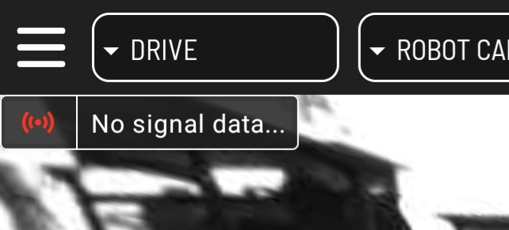
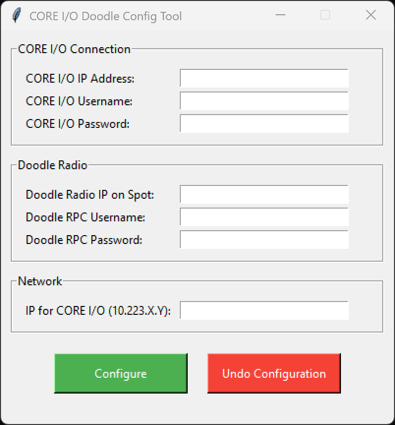
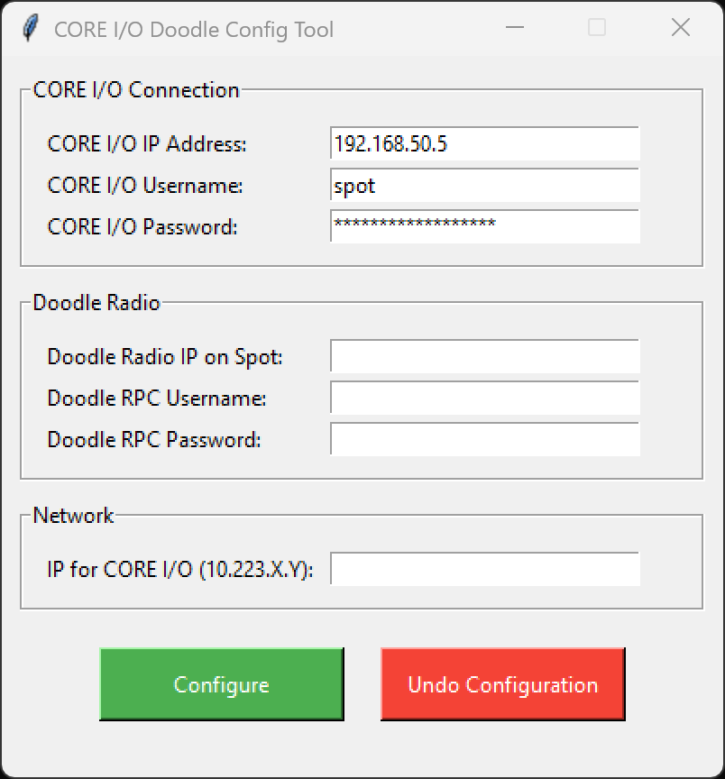
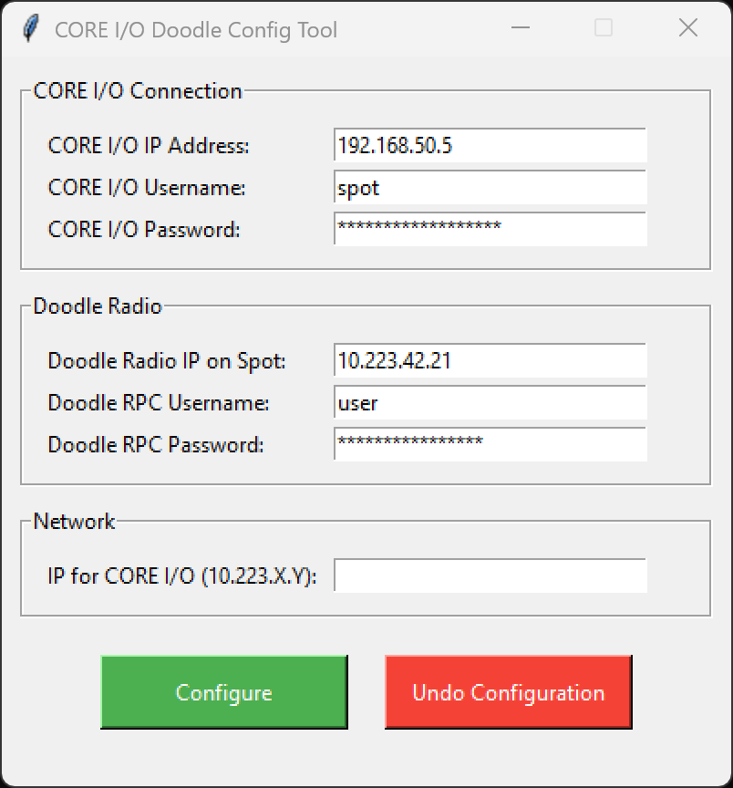
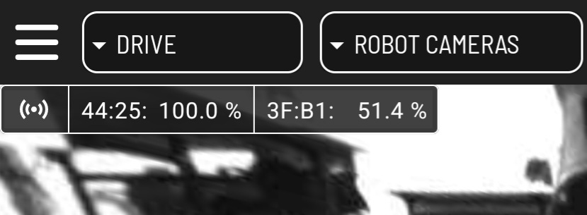

# Core I/O Doodle Battery Service Setup Guide

This guide will walk you through the steps for setting up the Doodle Battery Service extension on Spot CORE I/O.

Ensure you have downloaded all the necessary files. You should have the following:
- DoodleBatteryService.spx
- Core IO Doodle Config Tool.exe
- Core I/O Doodle Battery Service Setup Guide (this document)

## Installing the Doodle Battery Service Extension on CORE I/O
The Doodle Battery Service Spot extension reports the battery percentage of each Doodle mesh radio in your network and displays it to the screen in the Spot app. Here are the steps for installing the extension.

1. Navigate to CORE I/O's webpage in a web browser. By default this is located at https://192.168.50.5:21443/. 
2. Login using Spot's login credentials.
3. Click on the Extensions tab. 
4. Upload the DoodleBatteryService.spx extension file.

You have now successfully installed the extension.

#### Verification
To verify that the extension is running you can check in the Spot app. You should see a text box in the top-left corner that reads "No signal data...". This is because CORE I/O has not been configured yet. In order to see the battery data CORE I/O will need to be configured. This procedure is covered in the next section.

## CORE I/O Setup Procedure
CORE I/O will need to configured in order for the extension to communicate properly with your Doodle radio network and report the battery percentages. Here are the steps for configuring your CORE I/O.

We recommend connecting to CORE I/O using an Ethernet connection during this setup procedure. This ensures a stable connection when configuring network settings. CORE I/O has two ethernet ports that can be accessed by unscrewing and removing the lid.

In order to configure CORE I/O over a network cable, you will need to set your computer's IP address to any address on the `192.168.50.X` network except:
- `192.168.50.5`
- `192.168.50.3`

The subnet mask should be `255.255.255.0`. The gateway and DNS fields can be omitted.

Launch `CORE IO Doodle Config Tool.exe`. You should see this window.

#### CORE I/O Connection
Enter the IP address, username and password for logging into CORE I/O. By default, CORE I/O should have the IP address `192.168.50.5` and the username `spot`.

#### Doodle Radio
Enter the IP address of the Doodle Radio attached to Spot and the username and password for logging into the radio's JSON-RPC service. By default, the Doodle Radio IP should look like `10.223.X.Y`.

#### Network
Enter the IP address that will be assigned to CORE I/O to allow it to reach the Doodle radios. This address MUST be on the same subnet as the Doodle radios (default `10.223.X.Y`). **You must ensure that the IP you enter is unique and does not conflict with any of your Doodle radios on your network.**

## Restart Extension
**Make sure to restart the doodle_battery_service extension after applying the configuration. This must be done to ensure the parameters and credentials in the docker container are updated correctly.**

To restart the service:
1. Navigate to CORE I/O's webpage in a web browser. By default this is located at https://192.168.50.5:21443/.
2. Login using Spot's login credentials.
3. Click on the Extensions tab.
4. Scroll down to doodle_battery_service.
5. If the container is running, click the small stop button on the right side of the menu.
6. Click the start button to start the service again.

# Verification
To verify that the service is configured properly and running, open the Spot app on the tablet and check if the battery percentage values are displayed in the top-left corner of the screen.

If the service is not running or it is not configured properly, the signal display will instead show "No signal data...". Make sure the information entered into the configuration tool is correct, then re-apply the configuration and restart the extension.

# Troubleshooting

The extension periodically outputs logs when it scans for nearby stations. If the log output indicates 0 stations then it is likely that your network configuration settings are incorrect. Verify that the IP Address you assigned to CORE I/O is in the same subnet as your Doodle Radios (default 10.223.X.Y), re-apply the configuration and restart the extension.