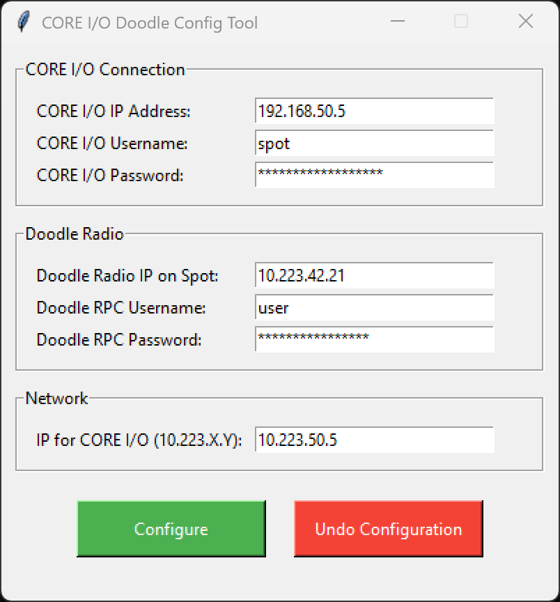

# Core I/O Doodle Battery Service Setup Guide

This guide will walk you through the steps for setting up the Doodle Battery Service extension on Spot CORE I/O.

Ensure you have downloaded all the necessary files. The ZIP file you downloaded should contain the following:
- A folder named "dist" containing the core_io_doodle_configurator tool
- DoodleBatteryService.spx
- core_io_doodle_setup_guide.pdf (this document)

## Connecting to CORE I/O via Ethernet
You must first attach an Ethernet cable from your computer to CORE I/O. CORE I/O has two available Ethernet ports that can be accessed by unscrewing and removing the lid.

1. Unscrew and remove the lid of your CORE I/O payload.
2. Plug an Ethernet cable into an available port on CORE I/O.
3. Plug the other end of the Ethernet cable into your computer.

### Setting a Static IP Address on Windows
In order for your computer to reach CORE I/O over the network, you must set a static IP. Here are the steps for setting a static IP on Windows.

Step 1 - Open the **Settings** and go to **Network & internet**.

Step 2 - Click **Ethernet**.

Step 3 - Under **IP Assignment** click **Edit**.

Step 4 - Select **Manual** from the drop-down menu.

Step 5 - Enable **IPv4**.

Step 6 - Enter your desired **IP address**. This must be of the format `192.168.50.X`. The IP address must be **unique**. It cannot be `192.168.50.3` or `192.168.50.5` or any other existing device on the `192.168.50.X` network. In this example, we're using the available IP of `192.168.50.77`.

Step 7 - Enter `255.255.255.0` as the **Subnet mask**, and `192.168.50.1` as the **Gateway**.

Step 8 - Enter **Preferred DNS** (e.g., `8.8.8.8`) or leave blank.

Step 9 - Click **Save** to save changes, then close all dialogs.

Your computer now has a static IP address.

## Installing the Doodle Battery Service Extension on CORE I/O
The Doodle Battery Service Spot extension reports the battery percentage of each Doodle mesh radio in your network and displays it to the screen in the Spot app. Here are the steps for installing the extension.

1. Navigate to CORE I/O's webpage in a web browser. By default this is located at https://192.168.50.5:21443/. 
2. Login using Spot's login credentials.
3. Click on the Extensions tab. 
4. Upload the DoodleBatteryService.spx extension file.

You have now successfully installed the extension.

#### Verification
To verify that the extension is running, open the Spot app. You should see a text box in the top-left corner that reads "No signal data...". This is because CORE I/O has not been configured yet. In order to see the battery data, CORE I/O will need to be configured. This procedure is covered in the next section.

## CORE I/O Setup Procedure
CORE I/O will need to configured in order for the extension to communicate properly with your Doodle radio network and report the battery percentages. Here are the steps for configuring your CORE I/O.

Launch `core_io_doodle_configurator.exe`. You should see this window.

#### CORE I/O Connection
Enter the IP address, username and password for logging into CORE I/O. By default, CORE I/O should have the IP address `192.168.50.5` and the username `spot`.

#### Doodle Radio
Enter the IP address of the Doodle Radio attached to Spot and the username and password for logging into the radio's RPC-JSON service. By default, the Doodle Radio IP should look like `10.223.X.Y`. If you don't have your Doodle Radio's RPC-JSON credentials see Appendix A.

#### Network
Enter the IP address that will be assigned to CORE I/O to allow it to reach the Doodle radios. This address MUST be on the same subnet as the Doodle radios (default `10.223.X.Y`). **You must ensure that the IP you enter is unique and does not conflict with any of the Doodle radios on your network.**

## Restart Extension
**Make sure to restart the doodle_battery_service extension after applying the configuration. This must be done to ensure the parameters and credentials in the docker container are updated correctly.**

To restart the service:
1. Navigate to CORE I/O's webpage in a web browser. By default this is located at https://192.168.50.5:21443/.
2. Login using Spot's login credentials.
3. Click on the Extensions tab.
4. Scroll down to doodle_battery_service.
5. If the container is running, click the small stop button on the right side of the menu.
6. Click the start button to start the service again.

# Verification
To verify that the service is configured properly and running, open the Spot app on the tablet and check if the battery percentage values are displayed in the top-left corner of the screen.

Each accessible radio in the network (except the SpotMesh-C radio mounted on Spot and connected to Core I/O) will report its battery percentage along with the last 4 digits of its MAC address. In the above example, the Doodle Battery Service has found two radios on the network as follows:

- Radio with MAC 00:30:1A:3B:44:25 with 100% battery reported as **44:25: 100.0 %**
- Radio with MAC 00:30:1A:3B:3F:B1 with 51.4% battery reported as **3F:B1: 51.4%**

If a radio is connected to permanent USB-C power, the battery percentage will not change. In the above example, radio 44:25 is connected to USB-C power and will always report 100%

If the service is not running or it is not configured properly, the signal display will instead show "No signal data...". Make sure the information entered into the configuration tool is correct, then re-apply the configuration and restart the extension.

# Troubleshooting

The extension periodically outputs logs when it scans for nearby radios. If the log output indicates 0 radios then it is likely that your network configuration settings are incorrect. Verify that the IP Address you assigned to CORE I/O is in the same subnet as your Doodle Radios (default 10.223.X.Y), re-apply the configuration and restart the extension.

# Appendix A - Getting your SpotMesh-C's RPC-JSON credentials

- Connect your computer directly to SpotMesh-C by Ethernet cable
- Set a Static IP on your computer to match the radio's subnet (10.223.X.Y where X & Y are different than SpotMesh-C, subnet mask of 255.255.0.0)
- Login to the radio using root credentials
- Click on Advanced Settings
- Click on Services
- Click on RPC JSON

The page will display your RPC JSON User Permission details. In the following example, the username is "configurator" and the password is "test"

